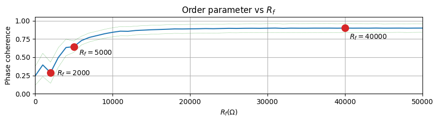
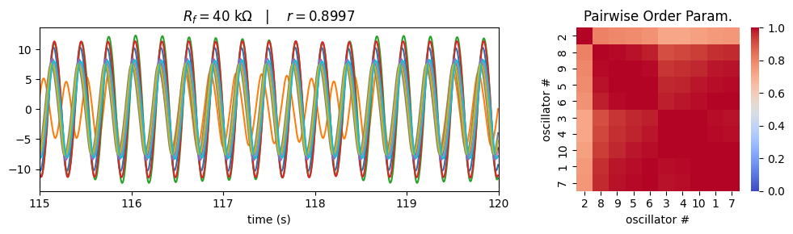

# QuadNet Estimation Challenge

This repository maintains data generated by the quadrature network for the QuadNet Estimation Challenge.

# The Challenge!

The challenge here is to estimate the phase of all oscillator based on the smallest possible set of measured
variable.

# About QuadNet

QuadNet is a network composed by quadrature oscillators. The nonlinear model of the quadrature oscillator can be found in [this article]([https://www.sba.org.br/open_journal_systems/index.php/sbai/article/view/3854](https://www.sba.org.br/open_journal_systems/index.php/sbai/article/view/3854)) [*] (portuguese only).

[*]Bittencourt, V.H.S., Silva Junior, W.C., Montanari, A.N., Freitas, L. (2023). Projeto, construção e modelagem não linear do oscilador de quadratura. In Anais do Simpósio Brasileiro de Automação Inteligente. SBA, Manaus. 

See also:
- Dias, A.C.B. Silva Junior, W.C. Bittencourt, V.H.S. Freitas, L. Aguirre, L. (2024). Verificação Experimental de Estados de Quimera em Redes de Osciladores de Quadratura. In Anais do Congresso Brasileiro de Automática. SBA, Rio de Janeiro (portuguese only).
- Bittencourt, V.H.S. Silva Junior, W.C. Dias, A.C.B. Freitas, L. Aguirre, L. (2024). Influência da Topologia na Emergência de Sincronismo Explosivo em Redes de Osciladores. In Anais do Congresso Brasileiro de Automática. SBA, Rio de Janeiro (portuguese only).

___

# Data description

The whole dataset is summarized in the table below.

| Label   | Nodes | Topology        |
|-----------|-----|-----------------|
| `exp001a` | 2   | two oscillators |
| `exp001b` | 2   | two oscillators |
| `exp001c` | 2   | two oscillators |
| `exp002a` | 10  | ring            |
| `exp002b` | 10  | ring            |
| `exp002c` | 10  | ring            |
| `exp003a` | 10  | small-world     |
| `exp003b` | 10  | small-world     |
| `exp003c` | 10  | small-world     |
| `exp004a` | 10  | scale-free      |
| `exp004b` | 10  | scale-free      |
| `exp004c` | 10  | scale-free      |

The data were generated by experiments described as below. In all experiments, the following variables were saved:
- `params`: list of parameters of each oscillator in the following order: `R1`, `R2`, `C1`, `C2`, `R3`, `C3`, `R4`, `R5`, `R6`, `R7`, `Vcc`, `Vd`, `Ra`, `Rb`, `R`, `Rf`
- `x`: array of states with shape (len(t), len(x0))
- `Rf`: parameter that defines the coupling strength
- `pc`: phase coherence, an order parameter that measure the degree of synchronization of whole network
- `pcMean`: time average of the phase coherence
- `pcStd`: standard deviation of the phase coherence

Parameters of all simulations:
- `dt = 0.005`: sampling period (seconds)
- `h = 0.005`: integration time step (seconds)
- `tfTr = 60`: transient time (seconds)
- `tf = 120`: total time of the simulation in permanent regime (seconds)

The parameters, in the `params` variable, was adjusted as shown in the table below.

| Component | Value |
|---|---|
| $R_f$ | 1 a 200 $\textrm{k}\Omega$ (according to the experiment) |
| $R, R_a, R_b$ | 100 $\textrm{k}\Omega$ |
| $R_1$ | 10 $\textrm{k}\Omega$ |
| $R_2$ | 1 a 200 $\textrm{k}\Omega$ (according to the experiment) |
| $R_3$ | 12 $\textrm{k}\Omega$ |
| $R_4$ | 22 $\textrm{k}\Omega$ |
| $R_5$ | 4,7 $\textrm{k}\Omega$ |
| $C_1, C_2, C_3$ | 2,2 $\mu\textrm{F}$ |

## Exp001: two coupled oscillators

Two oscillators with natural frequencies 3.80 Hz and 4.00 Hz, coupled with many different coupling strengths (`Rf`). The plot below can be used as a guide to verify the level of synchronization for each value of `Rf`.

  
Click here to see details...

  
  
  
  

____

## Exp002: ring network

Ring topology composed by 10 oscillators with natural frequencies (Hz): [3.9413, 3.9198, 3.8334, 3.9061, 3.9279, 3.9173, 3.8717, 3.8585, 3.9218, 3.8019], coupled with different coupling strengths (`Rf`).

  
Click here to see details...

  
  
  
  

____

## Exp003: small-world

Small-world topology composed by 10 oscillators with natural frequencies (Hz): [3.8042, 3.8327, 3.8415, 3.8149, 3.8213, 3.8354, 3.8428, 3.8126, 3.8467, 3.8031], coupled with different coupling strengths (`Rf`).

  
Click here to see details...

  
  
  
  

____

## Exp004: scale-free

Scale-free topology composed by 10 oscillators with natural frequencies (Hz): [3.9413, 3.9198, 3.8334, 3.9061, 3.9279, 3.9173, 3.8717, 3.8585, 3.9218, 3.8019], coupled with different coupling strengths (`Rf`). The adjacency matrix \( <strong>Adj</strong> \) is given by:

  
Click here to see details...

  
  
  
  
  

____

# How to cite this repository?

Please click the icon `Cite this repository` above in Github, or see the citation file included.

